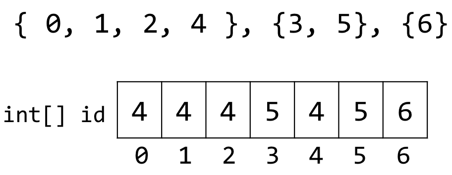

# 不相交集

---

> 笔记的来源：[CS 61B-2024 春季的课程](https://sp24.datastructur.es/)
> 课程主要内容：数据结构与算法分析
> 课程运用语言：Java

你可以在[我的笔记网站](https://lavachen.gitbook.io/lava-note)里获得更多有用的资源。

这个课有[**6 个 Homework，10 个 Lab，9 个 Project**](https://github.com/Berkeley-CS61B/skeleton-sp24)。其中第一个 project 是一个完整的 2024 游戏的实现，很有意思。**此文章对应的是课程 14 节的内容。主要讲述了一个不相交集的问题**

## 不相交集问题


我们可以用下面的代码描述上图元素的互相关系

```java
ds = DisjointSets(7)
ds.connect(0, 1)
ds.connect(1, 2)
ds.connect(0, 4)
ds.connect(3, 5)
ds.isConnected(2, 4): true
ds.isConnected(3, 0): false
```

而不相交集的问题就是实现`ds`的方法,我们要实现的是：

```java
public class DisjointSets {
    void connect(int a, int b) {}
    boolean isConnected(int a, int b) {}
}
```

## 实现方法

### 集合列表

一开始我们有`[{1},{2},{3},{4},{5},{6}]`
对于连接操作，我们可以将`a`和`b`所在的集合合并，即`[{1,2,3,4,5,6}]`

```java
void connect(int a, int b) {
    int setA = find(a);
    int setB = find(b);
    if (setA!= setB) {
        sets[setA].addAll(sets[setB]);
        sets.remove(setB);
    }
}
```

最后我们得到的算法性能为:

| 方法     | 初始化         | 连接     | 查询     |
| -------- | -------------- | -------- | -------- |
| 集合列表 | $$\Theta (N)$$ | $$O(N)$$ | $$O(N)$$ |

对于这个结果我们并不满意

### 快速查找

我们将给每一个元素分配一个标识符，这个标识符表示它所属的集合。

如果合并两个集合，就变成这样:


代码实现则是这样的：

```java
public boolean isConnected(int p, int q) {
        return id[p] == id[q];
	}

public void connect(int p, int q) {
    int pid = id[p];
    int qid = id[q];
    for (int i = 0; i < id.length; i++) {
        if (id[i] == pid) {
            id[i] = qid;
        }
    }
}
```

这个算法的性能如下：

| 方法     | 初始化         | 连接     | 查询     |
| -------- | -------------- | -------- | -------- |
| 集合列表 | $$\Theta (N)$$ | $$O(N)$$ | $$O(N)$$ |
| 快速查找 | $$O(N)$$       | $$O(N)$$ | $$O(1)$$ |

### 快速合并
